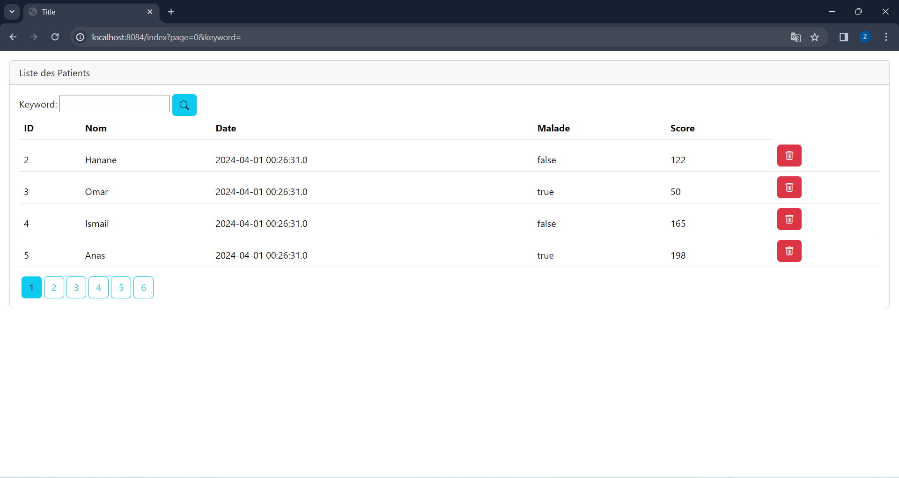
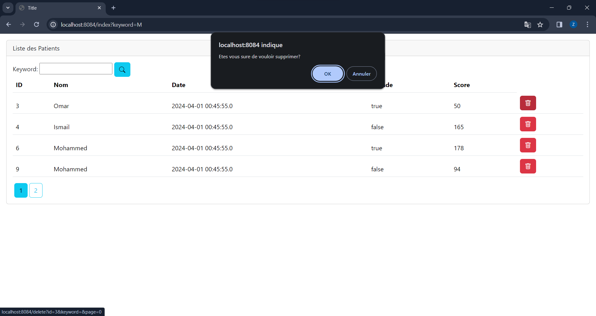
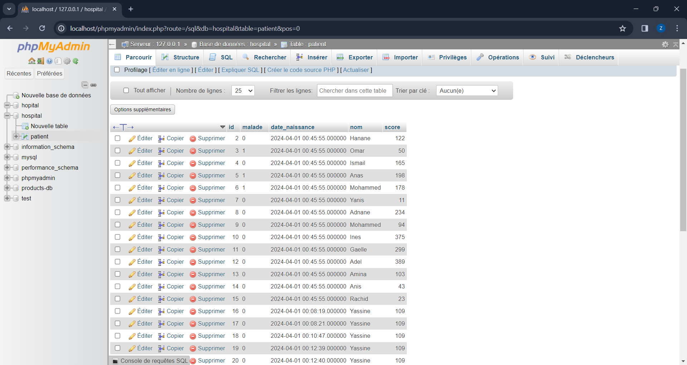
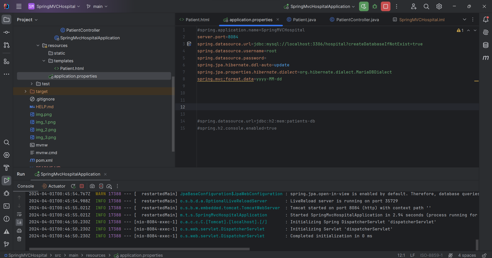

<!DOCTYPE html>
<html lang="en">
<head>
    <meta charset="UTF-8">
    <meta name="viewport" content="width=device-width, initial-scale=1.0">
    <title>README</title>
</head>
<body>
    <h1>J2EE SPRING MVC</h1>
    
 Application Web JEE basée sur Spring MVC, Thylemeaf et Spring Data JPA qui permet de gérer les patients.

    <h2>Fonctionnalités de l'Application :</h2>
<ul>
    <li>Afficher les patients</li>
    <li>Faire la pagination</li>
    <li>Chercher les patients</li>
    <li>Supprimer un patient</li>
    <li>Faire des améliorations supplémentaires</li>
</ul>
<h2>Technologie :</h2>
<li>Spring-Boot</li>
<li>Spring-MVC</li>
<li>Thylemeaf</li>
<li>JPA</li>
<li>BootStrap</li>
<li>MySQL</li>
<li>Lombok</li>
<li>H2Database</li>
<li></li>
<h2>Captures d'Écran :</h2>

Voici quelques captures d'écran de l'application :

</body>
</html>
